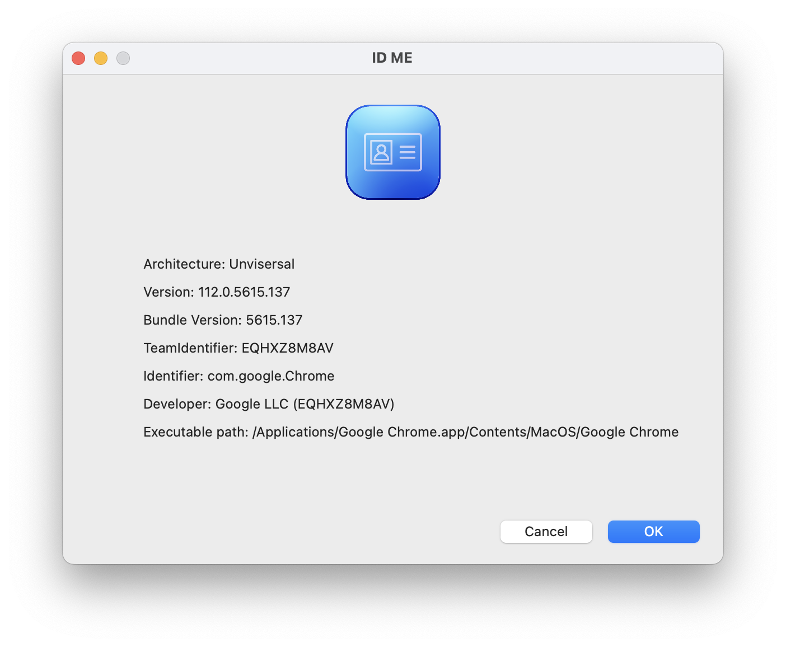

# ID Me

ID Me is a simple app that lists info version and developer information for a `.app` bundle.

Click `Choose` and browse for an app or drag and drop the app onto the "choose a file" field.

